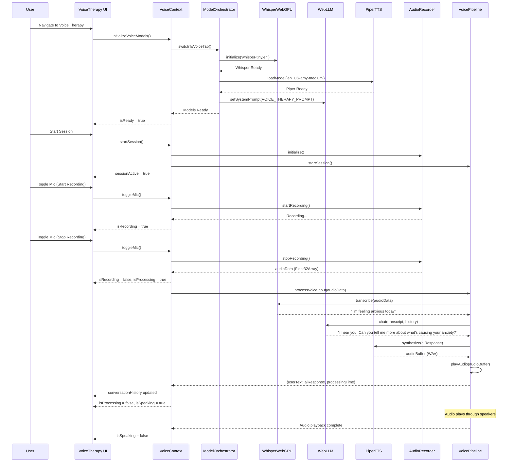
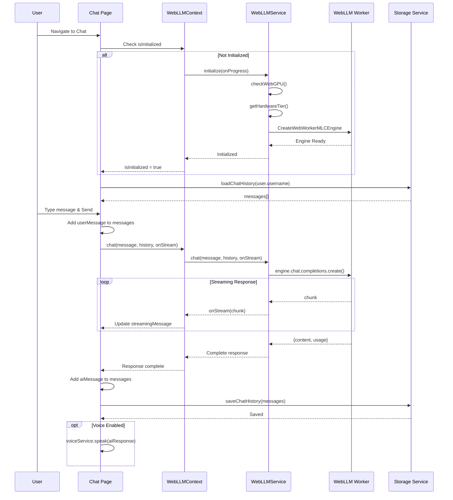
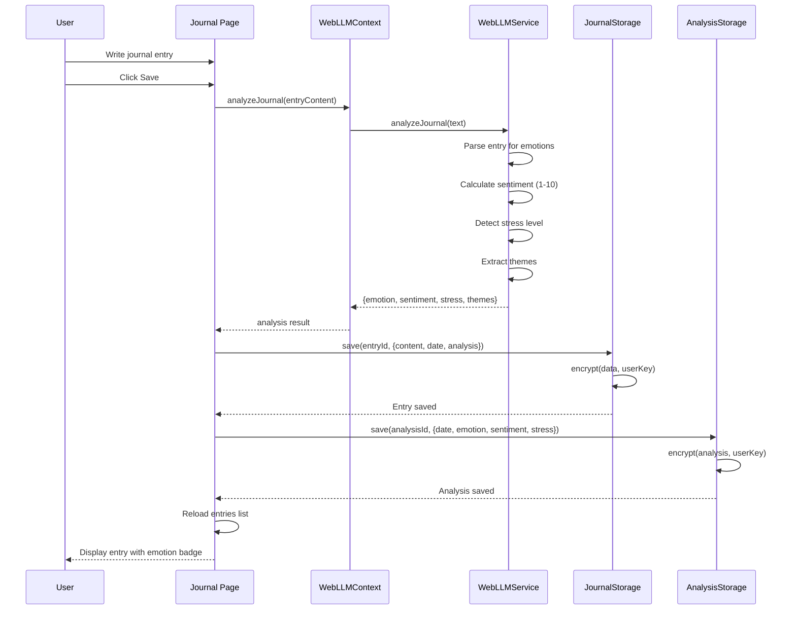
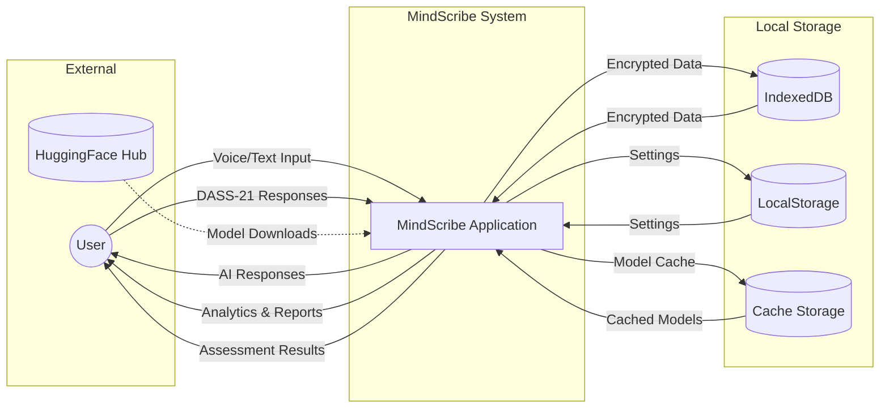
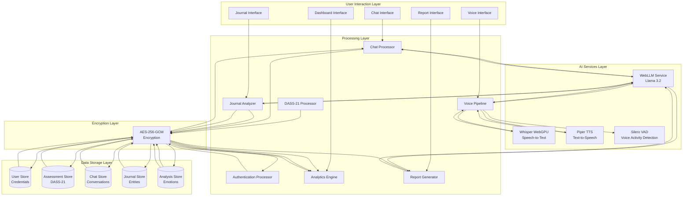
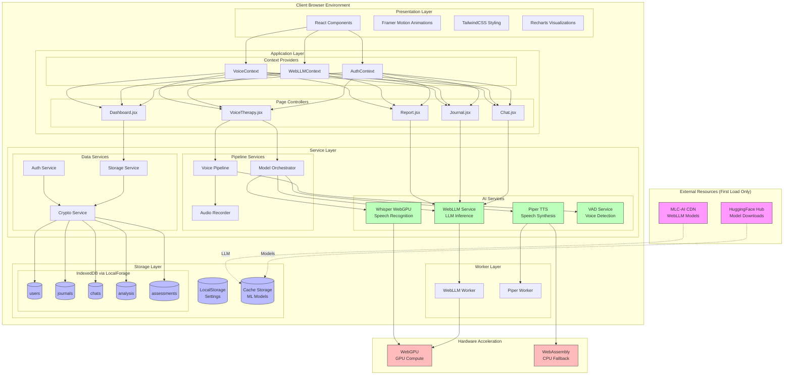
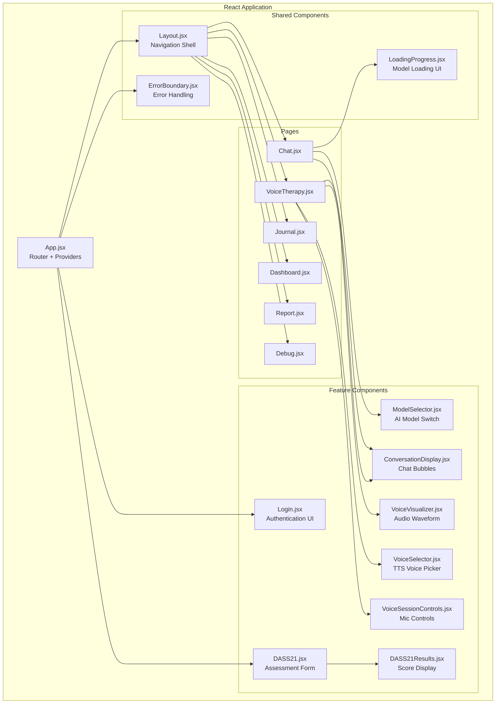

# MindScribe - Project Documentation

## Version 0.1 | Comprehensive Project Analysis

---

## 1. Problem Definition and Industry Relevance

### 1.1 Problem Statement

Mental health issues have become a global epidemic, with **1 in 4 people** experiencing mental health conditions during their lifetime. Key challenges include:

1. **Limited Access to Mental Health Professionals**: Long waiting times (often 6-12 months), high costs ($100-300/session), and geographical barriers limit access to therapy.

2. **Privacy Concerns**: Users hesitate to share sensitive mental health data with cloud-based services due to fears of data breaches, employer access, or insurance implications.

3. **Stigma and Anonymity**: Many individuals prefer anonymous self-help tools before seeking professional help due to social stigma.

4. **Lack of Continuous Support**: Traditional therapy is limited to scheduled sessions, leaving users without support during crisis moments.

5. **Journaling Discontinuity**: Paper journals lack analysis capabilities, and digital alternatives often don't provide actionable insights.

### 1.2 Industry Relevance

| Market Factor | Statistics |
|---------------|------------|
| Global Mental Health Apps Market | $6.2 billion (2024), projected $17.5 billion by 2030 |
| Digital Therapeutics Growth Rate | 24.3% CAGR |
| Post-Pandemic Mental Health Demand | 40% increase in anxiety/depression cases |
| AI in Healthcare Market | $45.2 billion by 2026 |

**Target Industry Segments:**
- **Healthcare & Telemedicine**: Complementary tool for therapists
- **Corporate Wellness Programs**: Employee mental health support
- **Educational Institutions**: Student counseling augmentation
- **Individual Self-Care**: Personal mental wellness tracking

### 1.3 Key Industry Pain Points Addressed

| Pain Point | MindScribe Solution |
|------------|---------------------|
| High therapy costs | Free, unlimited AI therapy sessions |
| Data privacy concerns | 100% offline processing, encrypted local storage |
| Waiting for appointments | Instant 24/7 availability |
| Session continuity | Persistent conversation history and mood tracking |
| Objective self-assessment | DASS-21 clinical assessment integration |

---

## 2. Understanding of Objectives and Scope

### 2.1 Primary Objectives

1. **Privacy-First Mental Health Companion**: Deliver a fully offline, browser-based AI therapy application with zero data transmission to external servers.

2. **Clinical Assessment Integration**: Incorporate validated psychological instruments (DASS-21) for baseline mental health evaluation.

3. **Multi-Modal Interaction**: Support both text-based chat and natural voice conversations for accessibility.

4. **Actionable Insights**: Provide emotional analytics, mood trends, and AI-generated reports based on journal entries.

5. **Therapeutic Voice Experience**: Implement ASMR-quality text-to-speech for soothing voice therapy sessions.

### 2.2 Functional Requirements

| ID | Requirement | Description |
|----|-------------|-------------|
| FR-001 | User Authentication | Secure local registration/login with encrypted credentials |
| FR-002 | DASS-21 Assessment | Complete 21-question psychological evaluation |
| FR-003 | AI Chat Therapy | Text-based conversation with empathetic LLM |
| FR-004 | Voice Therapy | Voice-to-voice natural conversation mode |
| FR-005 | Journal Module | Private journaling with AI emotion analysis |
| FR-006 | Dashboard Analytics | Mood trends, emotion distribution, stress levels |
| FR-007 | Report Generation | AI-generated mental health summary with PDF export |
| FR-008 | Emotional Balance Tracking | Positive/Negative/Neutral sentiment ratios |
| FR-009 | Hardware-Adaptive Model Selection | Auto-select AI model based on device capabilities |
| FR-010 | Offline Operation | Full functionality without internet (after initial load) |

### 2.3 Non-Functional Requirements

| Requirement | Target |
|-------------|--------|
| Response Time (Chat) | < 2 seconds for model inference |
| Voice Transcription | < 3 seconds for 5-second audio |
| TTS Synthesis | < 500ms latency for natural flow |
| Data Encryption | AES-256-GCM for all user data |
| Browser Support | Chrome/Edge with WebGPU capability |
| Memory Footprint | < 3GB GPU VRAM for default model |

### 2.4 Scope Boundaries

**In Scope:**
- Browser-based progressive web application
- Local LLM inference using WebGPU
- Speech-to-text (Whisper) and TTS (Piper) processing
- IndexedDB encrypted storage
- DASS-21 assessment with severity scoring

**Out of Scope:**
- Cloud backend services
- Real-time therapist connection
- Medical diagnosis or prescriptions
- Multi-language support (English only v0.1)
- Mobile native applications

---

## 3. Existing System and Market Study

### 3.1 Competitive Analysis

| Application | Pricing | Privacy | Offline | AI Therapy | Voice | Clinical Tools |
|-------------|---------|---------|---------|------------|-------|----------------|
| **Wysa** | Freemium ($99/yr) | Cloud | ❌ | ✅ | ❌ | Limited |
| **Woebot** | Free | Cloud | ❌ | ✅ | ❌ | CBT-based |
| **Replika** | Freemium ($70/yr) | Cloud | ❌ | ✅ | ✅ | ❌ |
| **Calm** | $70/year | Cloud | Partial | ❌ | ✅ | ❌ |
| **Headspace** | $70/year | Cloud | Partial | ❌ | ✅ | ❌ |
| **BetterHelp** | $260-400/mo | Cloud | ❌ | ❌ | ❌ | Therapist-led |
| **MindScribe** | **Free** | **Local** | **✅** | **✅** | **✅** | **DASS-21** |

### 3.2 Technology Landscape

| Component | Industry Standard | MindScribe Choice | Rationale |
|-----------|-------------------|-------------------|-----------|
| LLM Framework | Cloud APIs (GPT-4, Claude) | WebLLM (Llama 3.2) | Privacy, offline capability |
| Speech Recognition | Cloud (Whisper API) | Whisper WebGPU | Local processing, speed |
| Text-to-Speech | Cloud (ElevenLabs, Azure) | Piper-WASM | Offline, ASMR quality |
| Storage | Cloud databases | IndexedDB + LocalForage | Client-side encryption |
| Framework | React Native, Flutter | React + Vite | Browser-first, WebGPU access |

### 3.3 Gap Analysis

**Gaps in Existing Solutions:**

1. **Privacy Gap**: All major apps transmit conversation data to cloud servers
2. **Cost Gap**: Quality therapy apps require subscriptions ($50-100/year)
3. **Voice Gap**: Most AI therapy apps lack natural voice conversation
4. **Clinical Gap**: Consumer apps avoid validated assessment tools
5. **Continuity Gap**: Sessions don't persist across devices meaningfully

**MindScribe Differentiation:**
- **Zero-cloud architecture** with on-device AI
- **Clinically validated DASS-21** integration
- **Natural voice therapy** with ASMR-quality TTS
- **Complete offline operation** after first model download
- **End-to-end encryption** for all stored data

---

## 4. Solution Design & Technical Architecture

### 4.1 Use Case Diagram

```mermaid
flowchart TB
    subgraph Actors
        User((User))
        System((MindScribe System))
    end

    subgraph "Authentication Module"
        UC1[Register Account]
        UC2[Login]
        UC3[Logout]
    end

    subgraph "Assessment Module"
        UC4[Complete DASS-21 Assessment]
        UC5[View Assessment Results]
    end

    subgraph "Chat Therapy Module"
        UC6[Start Chat Session]
        UC7[Send Message]
        UC8[Receive AI Response]
        UC9[View Chat History]
        UC10[Clear Chat History]
    end

    subgraph "Voice Therapy Module"
        UC11[Initialize Voice Models]
        UC12[Start Voice Session]
        UC13[Record Voice Input]
        UC14[Transcribe Speech]
        UC15[Generate AI Response]
        UC16[Synthesize Speech]
        UC17[Play Audio Response]
        UC18[Select Therapist Voice]
    end

    subgraph "Journal Module"
        UC19[Create Journal Entry]
        UC20[Edit Journal Entry]
        UC21[Delete Journal Entry]
        UC22[Analyze Entry Emotion]
        UC23[View Past Entries]
    end

    subgraph "Analytics Module"
        UC24[View Mood Trends]
        UC25[View Emotion Distribution]
        UC26[View Stress Levels]
        UC27[Generate AI Report]
        UC28[Export PDF Report]
    end

    subgraph "System Functions"
        UC29[Select AI Model]
        UC30[Detect Hardware Tier]
        UC31[Encrypt/Decrypt Data]
    end

    User --> UC1
    User --> UC2
    User --> UC3
    User --> UC4
    User --> UC6
    User --> UC7
    User --> UC11
    User --> UC12
    User --> UC13
    User --> UC18
    User --> UC19
    User --> UC20
    User --> UC21
    User --> UC23
    User --> UC24
    User --> UC27
    User --> UC28
    User --> UC29

    UC4 --> UC5
    UC7 --> UC8
    UC8 --> UC9
    UC13 --> UC14
    UC14 --> UC15
    UC15 --> UC16
    UC16 --> UC17
    UC19 --> UC22
    UC24 --> UC25
    UC24 --> UC26

    System --> UC30
    System --> UC31
    UC30 --> UC29
```



### 4.2 Sequence Diagram - Voice Therapy Flow



### 4.3 Sequence Diagram - Chat Therapy Flow



### 4.4 Sequence Diagram - Journal Analysis Flow



### 4.5 Data Flow Diagram (Level 0 - Context)



### 4.6 Data Flow Diagram (Level 1 - Detailed)



### 4.7 High-Level Architecture Diagram



### 4.8 Component Architecture



### 4.9 Technology Stack

| Layer | Technology | Purpose |
|-------|------------|---------|
| **Frontend Framework** | React 18 | Component-based UI |
| **Build Tool** | Vite | Fast HMR, ES modules |
| **Styling** | TailwindCSS | Utility-first CSS |
| **Animations** | Framer Motion | Smooth transitions |
| **Charts** | Recharts | Dashboard visualizations |
| **Routing** | React Router v6 | SPA navigation |
| **LLM Runtime** | WebLLM (MLC-AI) | Browser LLM inference |
| **Speech Recognition** | Transformers.js (Whisper) | WebGPU-accelerated STT |
| **Text-to-Speech** | piper-wasm | WASM-based TTS |
| **Voice Activity** | Silero VAD | Speech detection |
| **Storage** | LocalForage (IndexedDB) | Encrypted persistence |
| **Encryption** | Web Crypto API | AES-256-GCM |
| **PDF Export** | jsPDF | Report generation |
| **GPU Compute** | WebGPU | Hardware acceleration |
| **CPU Fallback** | WebAssembly | SIMD-optimized |

---

## 5. Innovation and Value Addition

### 5.1 Technical Innovations

#### 5.1.1 Zero-Cloud AI Architecture
**Innovation**: Complete elimination of server dependencies for AI processing.

| Traditional Approach | MindScribe Innovation |
|---------------------|----------------------|
| API calls to OpenAI/Anthropic | On-device Llama 3.2 via WebGPU |
| Network latency (200-2000ms) | Local inference (~800ms) |
| Per-token billing | Zero recurring costs |
| Data transmitted to cloud | Data never leaves browser |

**Implementation**: WebLLM library executes quantized Llama 3.2 models directly in WebGPU compute shaders, achieving near-native performance.

#### 5.1.2 Unified Voice Pipeline
**Innovation**: Complete voice-to-voice conversation loop running entirely in-browser.

```
Audio Input → VAD (Silero) → STT (Whisper WebGPU) → LLM (Llama) → TTS (Piper) → Audio Output
     ↑                                                                              ↓
     └──────────────────────────── < 5 seconds total ────────────────────────────────┘
```

**Key Technologies**:
- **Silero VAD**: Detects speech segments to avoid processing silence
- **Whisper WebGPU**: 6-8x faster transcription vs WASM-only
- **Piper-WASM**: High-quality neural TTS with espeak-ng phonemizer
- **ASMR Voices**: Curated voice models for therapeutic experience

#### 5.1.3 Hardware-Adaptive Model Selection
**Innovation**: Automatic AI model selection based on device capabilities.

```javascript
// Auto-detection logic from hardwareCheck.js
const gpuTier = await getHardwareTier();
// Returns: { tier: 'low'|'medium'|'high', recommendedModel: 'Llama-3.2-1B...' }
```

| Hardware Tier | GPU VRAM | Recommended Model | Rationale |
|---------------|----------|-------------------|-----------|
| Low | < 4GB | Llama 3.2 1B (1.1GB) | Fits in limited memory |
| Medium | 4-6GB | Llama 3.2 1B (1.1GB) | Safe default |
| High | > 6GB | Llama 3.2 3B (1.9GB) | Better quality responses |

#### 5.1.4 Context-Aware Therapy Personalization
**Innovation**: DASS-21 assessment results dynamically modify AI behavior.

```javascript
// System prompt adaptation based on assessment
if (dassBaseline.severityLevels.anxiety.level !== 'Normal') {
  systemPrompt += `\nBe particularly mindful of their elevated anxiety levels.`;
}
```

The AI therapist receives the user's depression, anxiety, and stress scores, enabling personalized responses that acknowledge their specific mental health profile.

#### 5.1.5 Client-Side Encryption Architecture
**Innovation**: Military-grade encryption for all sensitive data without server involvement.

| Security Feature | Implementation |
|------------------|----------------|
| Key Derivation | PBKDF2 (100,000 iterations, SHA-256) |
| Encryption | AES-256-GCM (authenticated encryption) |
| Per-User Salt | Cryptographically random 16-byte salt |
| Key Storage | Derived in-memory, never persisted |
| Data Storage | IndexedDB with encrypted blobs |

**Privacy Guarantee**: Even if device storage is accessed, data cannot be decrypted without the user's password.

### 5.2 User Experience Innovations

#### 5.2.1 Progressive Model Loading
Users see real-time progress during model initialization:
- Percentage completion with estimated time
- Step-by-step status (Loading WebLLM → Whisper → Piper → Ready)
- Cached model detection for instant subsequent loads

#### 5.2.2 Therapeutic Voice Selection
Six curated ASMR-quality voices optimized for mental wellness:
- **Amy** 🌸: Soft, gentle whisper-like (default)
- **Jenny** 🌺: Calm British accent
- **Joe** 🌿: Deep, calming baritone
- **Alan** 🍃: Soft-spoken British male

#### 5.2.3 Real-Time Emotion Visualization
Dashboard provides at-a-glance mental health insights:
- Mood trend line charts over time
- Emotion distribution pie charts
- Stress level indicators (Low/Medium/High)
- Journaling consistency scores

### 5.3 Value Proposition Summary

| Stakeholder | Value Delivered |
|-------------|-----------------|
| **Individual Users** | Free, private, 24/7 AI therapy companion |
| **Privacy Advocates** | Zero-trust architecture with local-only processing |
| **Healthcare Providers** | Complementary tool for patient self-monitoring |
| **Developers** | Open architecture for mental health app development |
| **Researchers** | DASS-21 integration for validated outcome measurement |

### 5.4 Competitive Advantages

1. **First Fully Offline AI Therapy App**: No existing competitor offers complete offline LLM + Voice processing
2. **Clinical Assessment Integration**: DASS-21 is rarely found in consumer wellness apps
3. **Voice-to-Voice AI Therapy**: Natural conversation flow vs text-only alternatives
4. **Zero Recurring Costs**: One-time model download vs subscription fatigue
5. **Portable Privacy**: Data stays with user, works across browsers on same device

### 5.5 Future Innovation Roadmap

| Phase | Innovation | Impact |
|-------|------------|--------|
| v0.2 | Multi-language Whisper + TTS | Global accessibility |
| v0.3 | PWA with offline-first design | Mobile web experience |
| v0.4 | Therapist dashboard for anonymized insights | Professional integration |
| v1.0 | Edge deployment for mobile browsers | Native-like performance |

---

## Appendix A: Model Specifications

### Large Language Model
- **Model**: Llama 3.2 1B/3B Instruct (quantized q4f32/q4f16)
- **Runtime**: MLC-AI WebLLM
- **Context Window**: 4,096 tokens
- **Inference**: WebGPU compute shaders

### Speech Recognition
- **Model**: Whisper Tiny English (onnx-community)
- **Runtime**: Transformers.js with WebGPU/WASM
- **Sample Rate**: 16kHz mono
- **Latency**: 1-3 seconds per 5s audio

### Text-to-Speech
- **Model**: Piper neural TTS (VITS architecture)
- **Runtime**: piper-wasm with espeak-ng phonemizer
- **Sample Rate**: 22,050 Hz
- **Voices**: 6 English voices (US/UK, Male/Female)

### Voice Activity Detection
- **Model**: Silero VAD (ONNX)
- **Runtime**: ONNX Runtime Web
- **Purpose**: Trim silence, detect speech boundaries

---

## Appendix B: Data Models

### User Model
```typescript
interface User {
  username: string;
  passwordHash: string;  // bcrypt hash
  email: string;
  createdAt: string;     // ISO timestamp
}
```

### DASS-21 Assessment
```typescript
interface DASS21Result {
  scores: {
    depression: number;  // 0-42
    anxiety: number;     // 0-42
    stress: number;      // 0-42
  };
  severityLevels: {
    depression: { level: string; color: string };
    anxiety: { level: string; color: string };
    stress: { level: string; color: string };
  };
  responses: Record<number, number>;
  completedAt: string;
  userName: string;
}
```

### Journal Entry
```typescript
interface JournalEntry {
  id: string;
  content: string;
  date: string;
  wordCount: number;
  analysis: {
    emotion: string;
    sentiment: number;   // 1-10
    stress: 'low' | 'moderate' | 'high';
    themes: string[];
  };
}
```

### Chat Message
```typescript
interface ChatMessage {
  role: 'user' | 'assistant';
  content: string;
  timestamp: string;
  usage?: {
    prompt_tokens: number;
    completion_tokens: number;
    total_tokens: number;
  };
}
```

---

*Document Version: 1.0 | Generated for MindScribe v0.1*
